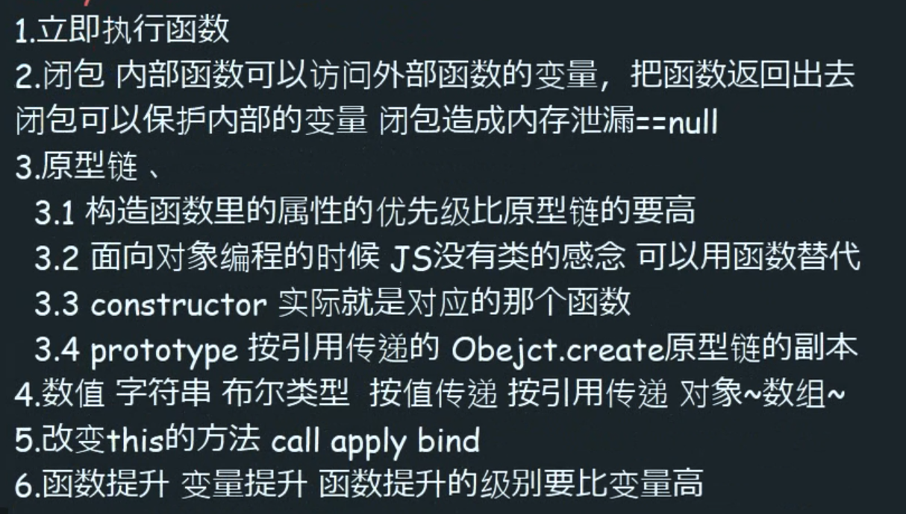

```
    // 构造函数实现继承
    function Car(color) {
        // constructor == Car
        this.color = color;
        console.log(111);

    }
    Car.prototype.sail = function () {
        console.log("颜色", this.color);
    };

    function BWM(color) {
        Car.call(this, color);
    }
    // 按引用传递
    // 1.拿到弗雷原型链上的方法
    // 2.不能让构造函数执行两次
    // 3.引用的原型链不能是按地址引用
    // 4.修正子类的constructor
    var __pro = Object.create(Car.prototype);
    __pro.prototype = BWM;
    BWM.prototype = __pro;

    var a = new BWM"red");
    console.log(a);

```
```
    // s6类继承
    class People {
        // 构造函数
        constructor(name, age){
            this.name = name;
            this.age = age;
        }
        
        getName(){
            return this.name;
        }
    }
    
    class English extends People{
        constructor(name, age, language){
            super(name, age); // 必须执行
            this.language = language;
        }
        intoduce(){
            console.log("neme " + this.name);
        }
    }
```

</img>

```
    // 柯里化
    // 一种孕育使用部分参数生成函数的方式
    // 高阶函数绕不过去的函数

    // jquery 源码
    function isType(type) {
        return function (obj) {
            return Object.prototype.toString.call(obj) === "[object" + type + "]"
        }
    }

    var isNumber = isType("Number");

    isNumber(1);
    
    // 柯里化 (管道)
    function pipe() {
        return function () {
            // this不需要 null
            return f.call(null, g.apply(null, arguments))
        }
    }
    var fn = pipe(f, g);
    console.log(fn(2));
    
```

```
    // 反柯里化
    Function.prototype.uncurry = function () {
        return this.call.bind(this);
    };
    // push 通用化 源码中只要有length 并且可以通过下标访问的都可以用push
    var push = Array.prototype.push.uncurry();
    
    var arr = [];
    push(arr, 1);
    push(arr, 2);
    ...
    
    // 比如一些构造函数重载，需要把arguments转换成"数组"才能使用push
```
