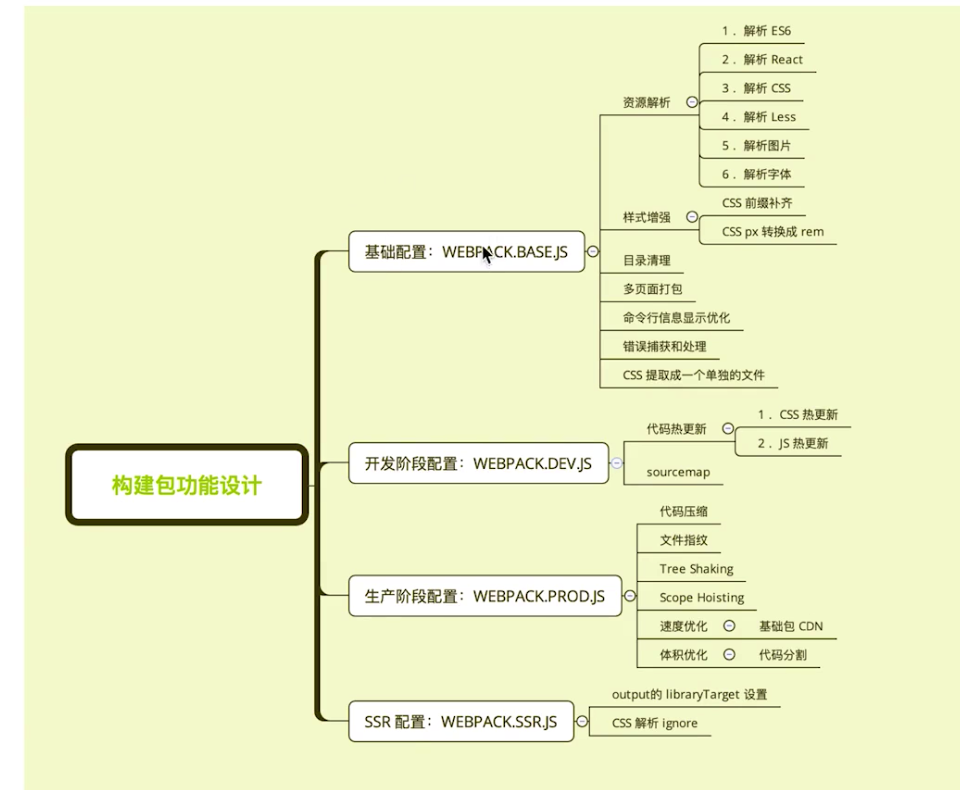

* babel 配置

    yarn add babel-loader @babel/core @babel/preset-env -D
    ```
    {
        test: /\.js$/,
        exclude: /(node_modules|bower_components)/, // 排除文件 提高打包速度
        use: {
          loader: 'babel-loader',
          options: {
            presets: ['@babel/preset-env'] // 这部分也可以移到 .babelrc 文件中
          }
        }
      },
    ```
* react配置 
    yarn add react react-dom 
    yarn add @babel/preset-react -D 
    修改babel-loader配置
    ```

      {
        test: /\.js$/,
        exclude: /(node_modules|bower_components)/, // 排除文件 提高打包速度
        use: {
          loader: 'babel-loader',
          options: {
            presets: ['@babel/preset-env', '@babel/preset-react'] // 修改这里 增加'@babel/preset-react'
          }
        }
      },
    ```
    
* css、less 配置 

    yarn add style-loader css-loader less-loader -D
    
    ```
    {
        test: /\.css$/,
        use: [ 'style-loader', 'css-loader' ]
      },
      {
        test: /\.less/,
        use: ['style-loader', 'css-loader', 'less-loader']
      },
    ```
    
* 图片、字体
    yarn add file-loader -D 
    出了file-loader也可以用url-loader
    
   ```
   {
       test: /\.(woff|woff2|eot|ttf)$/,
       use: 'file-loader'
   },
    {
        test: /\.(woff|woff2|eot|ttf)$/,
        use: 'file-loader'
    }
    ```

* 设置node环境变量
    yarn add cross-env -D
    
    ```
    "build": "cross-env NODE_ENV=production webpack"
  
    ```
    通过 cross-env key=value 形式设置后，这样就可以通过 process.env.NODE_ENV 来获取
    
* watch 设置  
    watch: env === "development" ? true : false, // watch 
    
* source-map 设置  
    devtool: env === "development" ? 'inline-source-map' : ""
    
* 热更新 这里是通过webpack-dev-server来配置的， 还可以通过webpack-hot-middleware实现
    * 直接在package.json 和 webpack.config.js配置
    ```
    // package.json 
    "scripts": {
        "dev": "cross-env NODE_ENV=development webpack-dev-server --open",
      },
      
    // webpack.config.js
    devServer: { // 移到server.js里
      contentBase: './dist',
      hot: env === "development" ? true : false, // 热更新
      open: env === "development" ? true : false // 启动打开浏览器 也可以通过webpack-dev-server --open命令形式
    }
    ```
    * 配置和服务分开的形式，这种形式更灵活，react脚手架就是通过这种形式做的  
      devServer部分的配置可以全部移到server.js里面去，这样这一根据不同的环境在server里配置不同的配置，执行不同的server更灵活，
    ```
       // package.json
       
       "scripts": {
           "server": "cross-env NODE_ENV=development node server.js",
         },
         
       output: {
           path: path.resolve(__dirname, 'dist'),
           filename: '[name].js',
           publicPath: '/', // 修改这里
         }, 
         
       
    ```
    ```
    // server.js
    // https://www.webpackjs.com/guides/hot-module-replacement/
    
      const webpackDevServer = require('webpack-dev-server');
      const webpack = require('webpack');
      
      const config = require('./webpack.config.js');
      const options = {
        contentBase: './dist', // 目录
        hot: true, // 热更新
        host: 'localhost', // 端口
        open: true // 是否打开浏览器
      };
      
      webpackDevServer.addDevServerEntrypoints(config, options);
      const compiler = webpack(config);
      const server = new webpackDevServer(compiler, options);
      
      server.listen(5000, 'localhost', () => {
        console.log('dev server listening on port 5000');
      });
    ```

* clean-webpack-plugin 清楚, html-webpack-plugin 创建html,多页面打包使用  
    ```
    const HtmlWebpackPlugin = require('html-webpack-plugin');
    const { CleanWebpackPlugin } = require('clean-webpack-plugin'); // 地板
    
    plugins: [
        new CleanWebpackPlugin(),
        // new CleanWebpackPlugin(['dist/*']) for < v2 versions of CleanWebpackPlugin
        new HtmlWebpackPlugin({
          template: '../src/index.html'
        })
      ]
    ```

* mini-css-extract-plugin 提取生成css文件，加contenthash  
    ```
    const MiniCssExtractPlugin = require('mini-css-extract-plugin');
    
      {
        test: /\.css$/,
        // use: [ 'style-loader', 'css-loader' ], // style-laoder 和 mini-css-extract-plugin不可以同时使用, style-laoder是把样式插入到head里面, 不生成css文件
        use: [ MiniCssExtractPlugin.loader, 'css-loader' ] // style-laoder 和 mini-css-extract-plugin不可以同时使用, style-laoder是把样式插入到head里面, MiniCssExtractPlugin提取生成css文件
      },
      {
        test: /\.less/,
        // use: ['style-loader', 'css-loader', 'less-loader'], // style-laoder 和 mini-css-extract-plugin不可以同时使用, style-laoder是把样式插入到head里面, 不生成css文件
        use: [ MiniCssExtractPlugin.loader, 'css-loader', 'less-loader']
      },
    
    plugins: [
        new MiniCssExtractPlugin({
                filename: '[name]_[contenthash:8].css'
            }),
      ]
    ```
    
* optimize-css-assets-webpack-plugin 压缩css 

    ```
    const OptimizeCssAssetsPlugin = require('optimize-css-assets-webpack-plugin');
    new OptimizeCssAssetsPlugin({
          assetNameRegExp: /\.optimize\.css$/g,
          cssProcessor: require('cssnano'),
          cssProcessorPluginOptions: {
            preset: ['default', { discardComments: { removeAll: true } }],
          },
          canPrint: true
        })
    ```

* html-webpack-externals-pligin 排除文件 

* SplitChunksPlugin 提取公共包  

* three shaking 打包的时候删除无用代码, webpack4 nodo设置production 默认开启  

* Scope Hoisting 

* @babel/plugin-syntax-dynamic-import 代码分割 懒加载
  commonJs require.ensure  
  es6 动态import 需要babel转换  

* eslint-loader babel-eslint
  ```
  // .eslintrc.js 配置文件
  {
    test: /.js$/,
    use: [
      'bable-loader',
      'eslint-loader
    ]
  }
  ```

* 打包npm包 支持 nmd cmd cjs script  打包出.min.js  
  ```
  const TerserPulugin = require('terser-webpack-plugin');

  {
    entry: {
      'index': 'src/index.js',
      'index.min': 'src/index.js',
    },
    mode: 'none',
    optimization; {
      minimize: true,
      minimizer: [
        new TerserPulugin({
          include:/\.min\.js$/,
        })
      ]
    }
  }

  // 引入建议
  if(process.env.NODE_ENV === 'production'){
    modeule.exports = require(xxx.min.js)
  }else {
    modeule.exports = require(xxx.js)
  }
  ```

  * webpack ssr

  * stats 日志 
    error-only 错误
    minimal 错误或重新编译
    none 没有
    normal 标准
    verbose 全部输出
    插件 friendly-errors-webpack-plugin  

* webpack构建错误捕获、中断处理 
  echo $? 获取错误码  
  node.js 中的 processs.exit规范 
  0表示成功 回调函数中的 err为null  
  非0表示失败 回调函数中 err不为null err.code就是传给exit的数字
  ```js
  plugins: [
    function() {
        this.hooks.done.tap('done', (stats) => {
            if (stats.compilation.errors && stats.compilation.errors.length && process.argv.indexOf('--watch') == -1)
            {
                console.log('build error');
                process.exit(1);
            }
        })
    },
  ]
  ```

* 可维护的wenpack配置 
    webpack-merge  合并配置  module.exports = merge(baseConfig, devConfig);  
      
    
* travis-ci  持续集成，合并前必须通过单测才能合并代码成功  

* npm版本号，修改命令，不因该手动修改，会自动改版package.json中的版本号，git commit，同时也会自动打git tag  
    npm version patch 补订  
    npm version minor 小版本
    npm version major 大版本
    
* git commit 规范（angularjs的规范）；changelog规范  
    commit： husky、validate-commit-msg 怎么结合到webstorm上？？？  
    ```
       
      "script":{
          "commitmsg": "validate-commit-msg",
          "changelog": "conventional-changelog -p angular -i CHANGELOG.md -s -r 0"
      }
    ```  
* npm 版本号 sermver规范  
    alpha：是内部测试版，一般不向外部发布，会有很多 Bug。一般只有测试人员使用  
    beta：也是测试版，这个阶段的版本会一直加入新的功能。在 Alpha 版之后推出  
    rc：Release Candidate) 系统平台上就是发行候选版本。RC 版不会再加入新的功能了，主 要着重于除错  
    主版本号：当你做了不兼容的 API 修改  
    次版本号：当你做了向下兼容的功能性新增  
    修订号：当你做了向下兼容的问题修正  
    
* detect-port-alt 端口占用检测 react-cli中启动检测端口号有用到

* px2rem-loader px转rem https://github.com/amfe/lib-flexible

* webpack states 对象

* 图片压缩

* 打包缓存

* polyfill （怎么下发文件的）

* babylon 生成AST  babel-traverse分析依赖关系 babel-core 把AST转换成源码  

* loader-runner 不依赖webpack运行loaders 进行loader调试  

* loader-utils 获取loader参数  

